# Airline Performance Analysis ✈️

This project, part of the **Data-Analysis-Projects** repository, explores airline performance using data visualization and statistical analysis. The notebook **Airline-Performance.ipynb** includes **19 plots** (18 static, 1 animated) to help uncover patterns and insights in airline operations.

Since GitHub does not render plots from notebooks by default, screenshots and a GIF have been added for clarity.

---

## 📊 Project Overview

This analysis covers:

- Flight delays and cancellations
- Airline and airport performance trends
- Passenger traffic over time
- Weather impact on flights
- Animated hourly flight behavior

---
## 📷 Visualization Gallery

> These are static images and an animated GIF for quick preview.  
> For interactive versions, open the notebook locally.

### 🖼️ Static Plots

**1. Average Delay by Day of Week**  
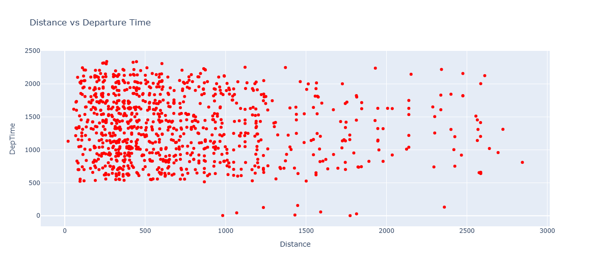

**2. Top Delayed Airlines**  
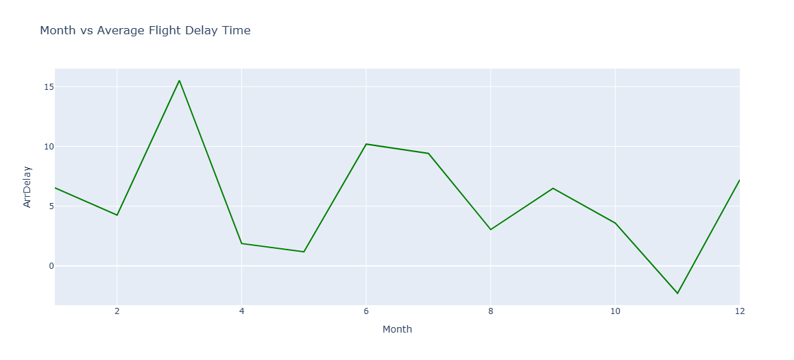

**3. Route Popularity**  
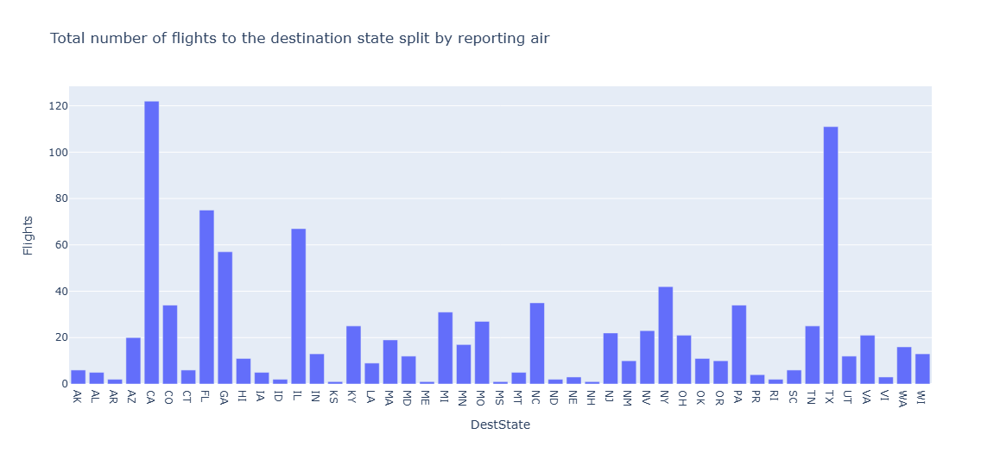

**4. Histogram of Flight Delays**  
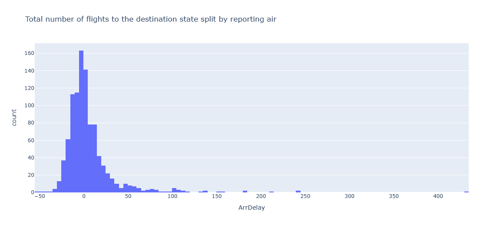

**5. Scatterplot: Delay vs Distance**  
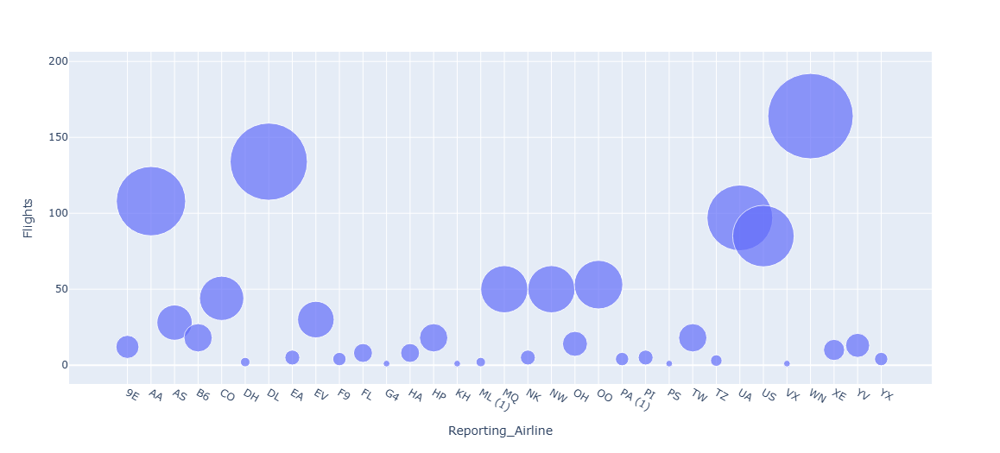

**6. Boxplot by Carrier**  
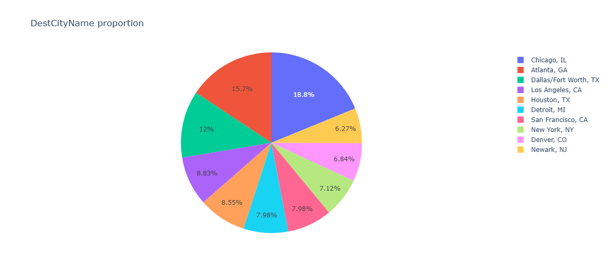

**7. Average Departure Delay by Month**  
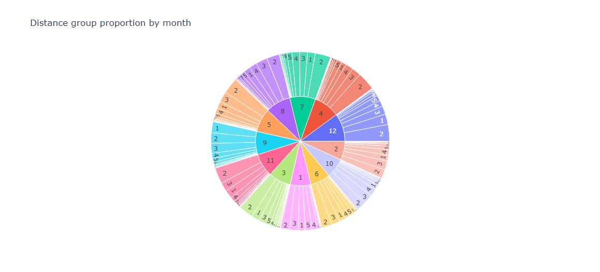

**8. Correlation Matrix**  
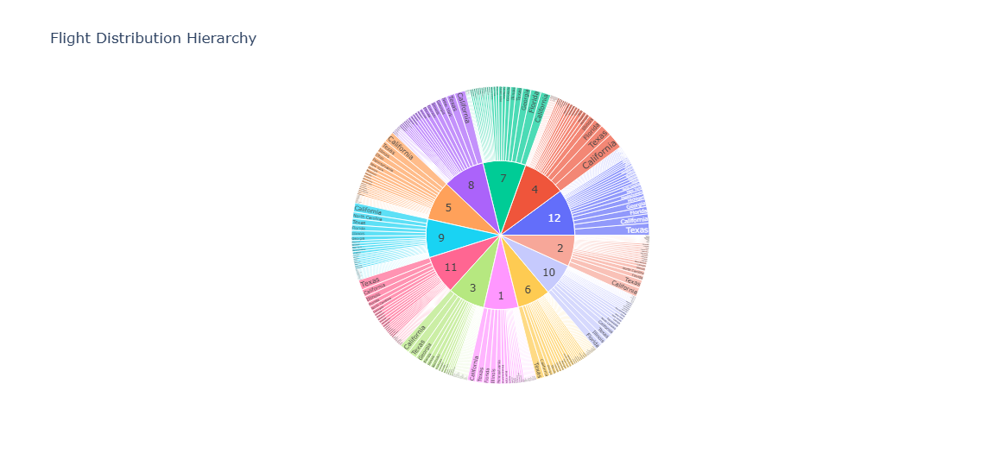
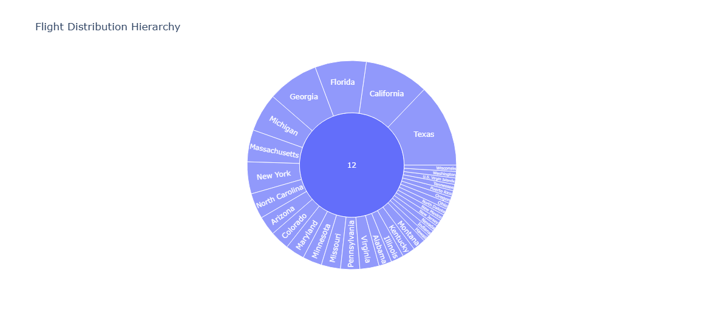


**9. Total Flights Over Time**  
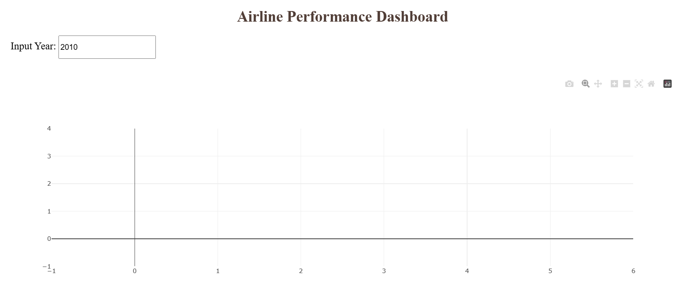

**10. Delay by Aircraft Type**  
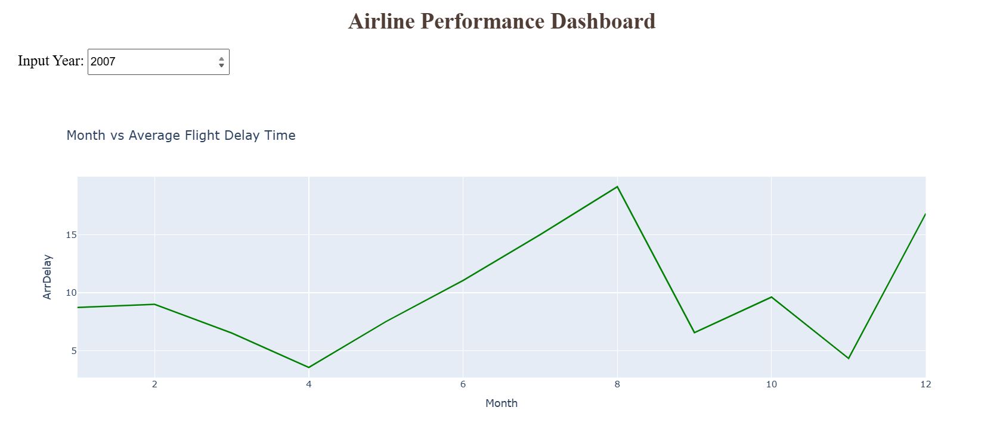

**11. Day vs Night Delay Comparison**  
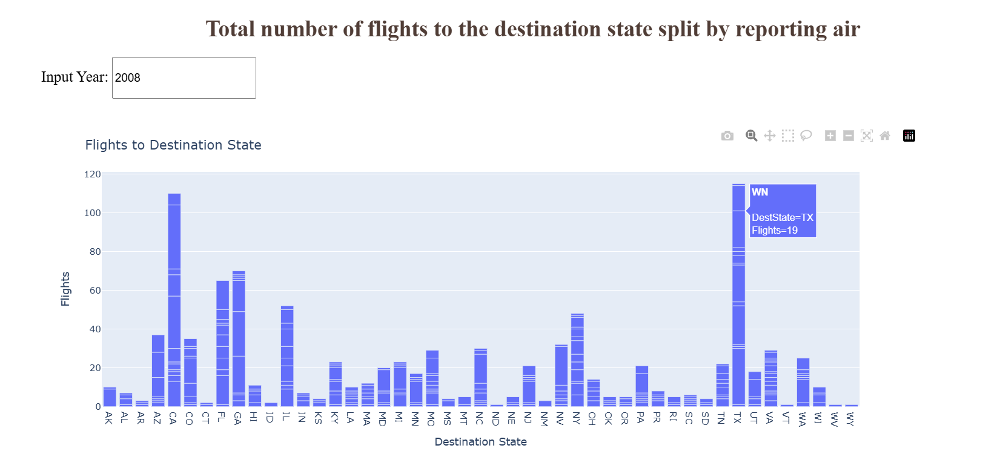

---

### 🎞️ Animated Visualization

**19. Hourly Delay Pattern (GIF)**  
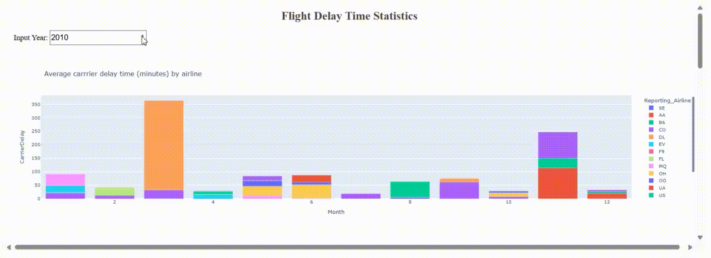

---
**1. Delay Distribution by Airline**  
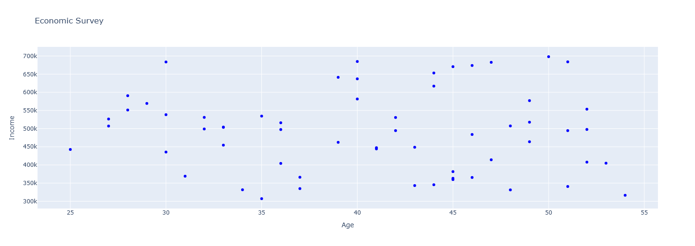

**2. Flight Volume by Month**  
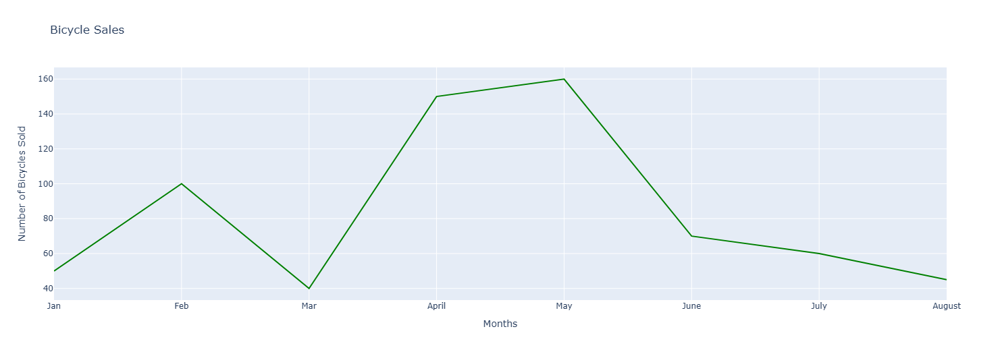

**3. Delay Reasons Breakdown**  
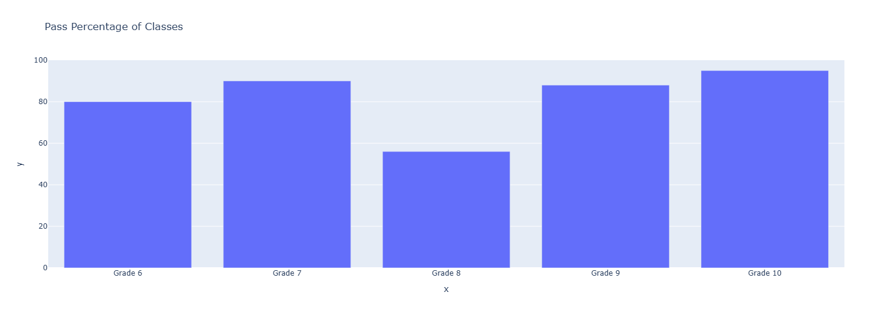

**4. Cancellations by Weather**  
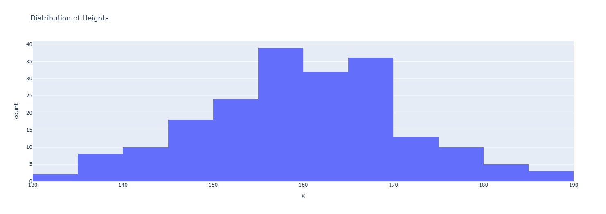

**5. Flight Delay Heatmap**  
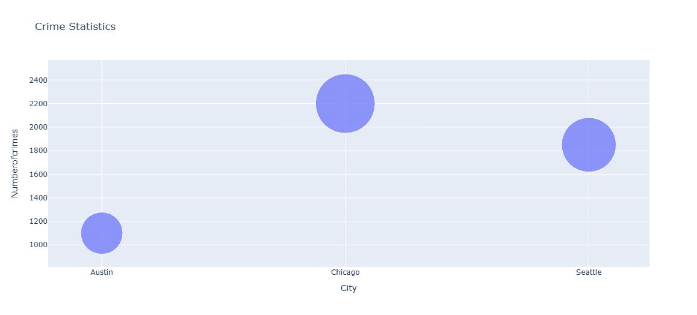

**6. Airport Performance Comparison**  
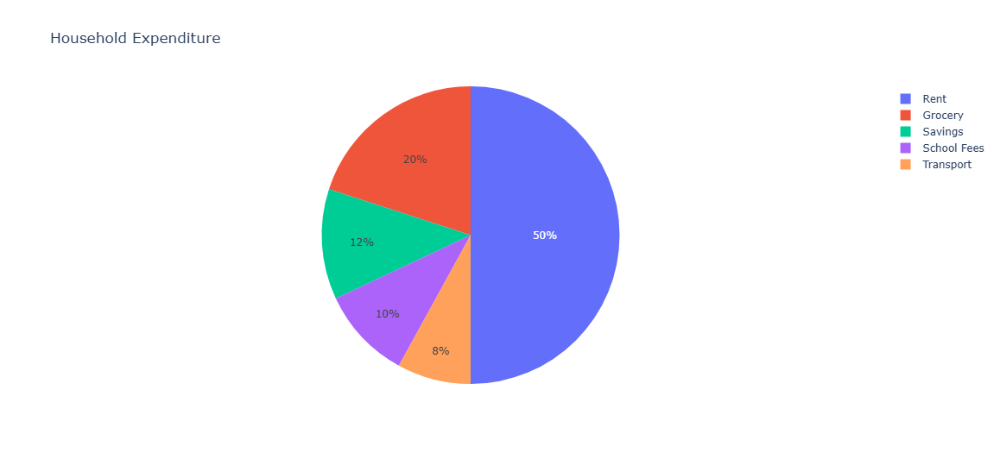

**7. Delay by Time of Day**  


---
## 🚀 Run Locally

To view the full interactive analysis:

```bash
git clone https://github.com/yourusername/Data-Analysis-Projects.git
cd Data-Analysis-Projects
jupyter notebook Airline-Performance.ipynb
Ensure the plots/ folder is in the same directory for the README visuals to display properly.

📌 Dependencies
pip install pandas numpy matplotlib seaborn plotly scikit-learn
📃 License
This project is licensed under the MIT License.


